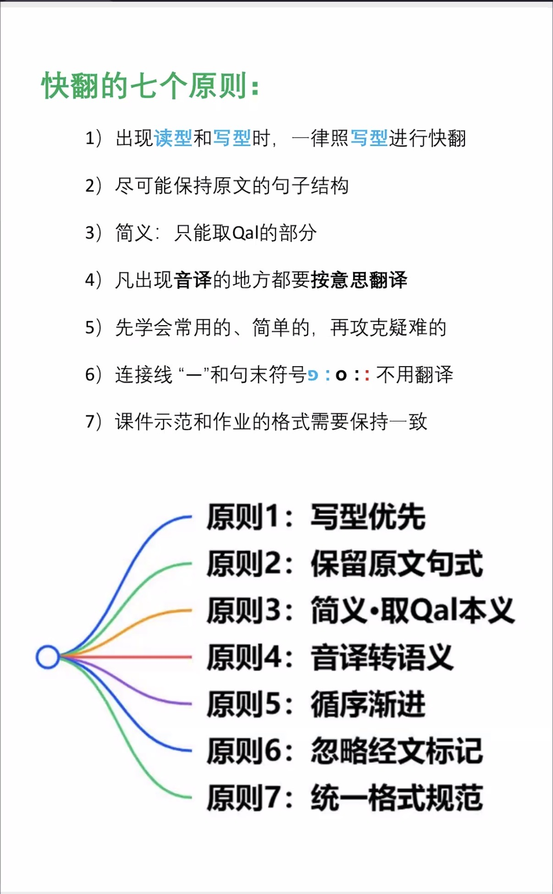

# 快速希伯来语课程 · 快速翻译（快翻）笔记

## 一、快翻的七个原则

| # | 原则 | 要点 |
|---|------|------|
| 1 | **写型优先** | 出现**读型**（Qere）和**写型**（Ketiv）时，一律照**写型**进行快翻 |
| 2 | **保留原文句式** | 尽可能保持原文的句子结构 |
| 3 | **简义 · 取 Qal 本义** | 简义只能取 Qal 的部分 |
| 4 | **音译转语义** | 凡出现**音译**的地方都要**按意思翻译** |
| 5 | **循序渐进** | 先学会常用的、简单的，再攻克疑难的 |
| 6 | **忽略经文标记** | 连接线 “־”（maqqef）和句末/段落符号 `פ` `ס` `׃` 不用翻译 |
| 7 | **统一格式规范** | 课件示范和作业的格式需要保持一致 |

> 补充：`׃` 为节末号（sof pasuq）；`פ`（petuchah）、`ס`（setumah）为段落标记。

---

## 二、分词（Participle）

分词是动词的一种，代表**连续不间断的行动或状态**，近似英文的 *being* 动词与现在分词 *doing*。

### 分词涉及的内容

1. 主动分词、被动分词
2. 单数、复数
3. 阴性、阳性
4. 词干
5. 分词可当做**形容词**、**名词**

### 思考：分词和别的动词有什么区别？

### 例句：士师记 14:14

> מֵהָאֹכֵל יָצָא מַאֲכָל וּמֵעַז יָצָא מָתוֹק׃

快翻：

- **מֵהָאֹכֵל** 从那吃者 · **יָצָא** 他已经出来 · **מַאֲכָל** 食物
- **וּמֵעַז** 和从强者 · **יָצָא** 他已经出来 · **מָתוֹק** 甜食

说明：

- **הָאֹכֵל**：Qal 主动分词（阳性单数）+ 定冠词 הַ，作**名词**用 →「那吃者」。
- **יָצָא**：Qal 完成式 3 阳单 →「他已经出来」。
- 根据句子结构和上下文判断，App 漏掉了“定冠词 ha”。

